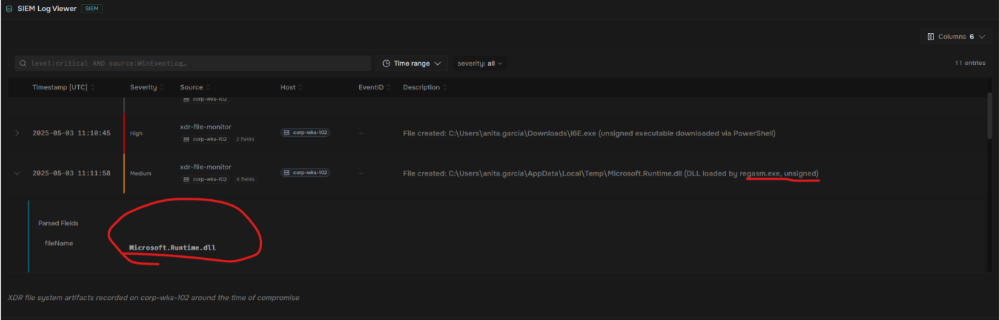
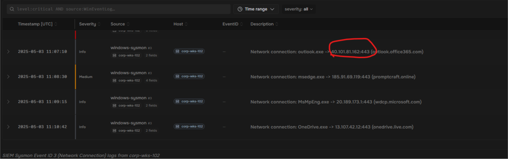
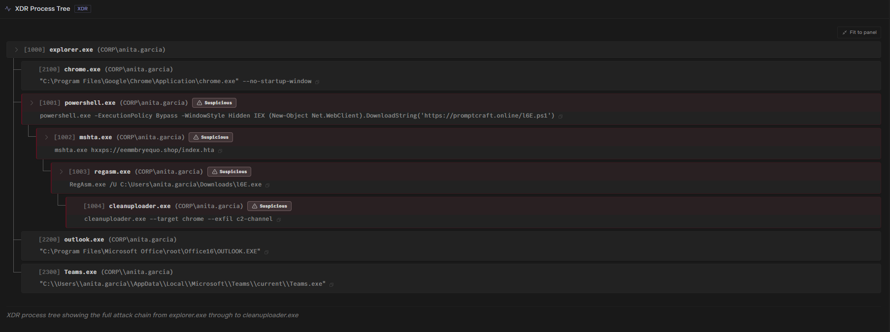
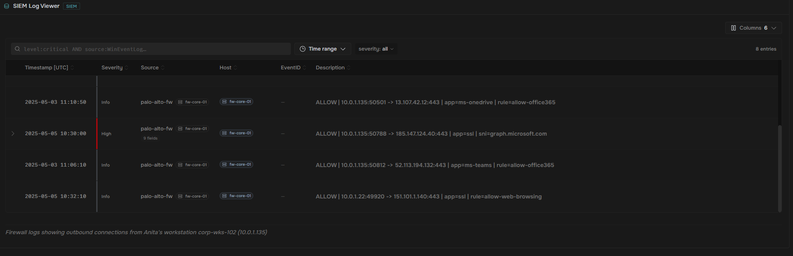
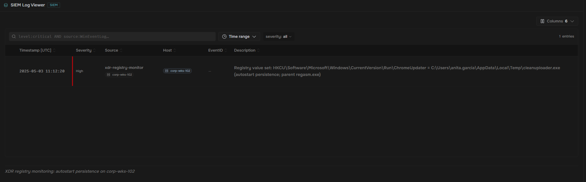

#Summary: The ClickFix social engineering technique uses dialogue boxes containing fake error messages to trick victims into copying, pasting, and running malicious content. In this scenario, a user was targeted with a ‘Verify You Are Human’ CAPTCHA check that led to a significant endpoint compromise. You will analyze the ‘paste-and-run’ execution chain, investigate PowerShell activity initiated via the Windows Run dialogue, and identify the deployment of an information stealer

#Tools used: SIEM, XDR, FW

#Notes: An urgent ticket from HR employee Anita Garcia reported that her workstation – corp-wks-102 has been “acting strange” since yesterday afternoon. She mentions visiting a research website that asked her to complete a CAPTCHA verification

#ClickFix – A social engineering technique that surged through 2024 – 2025. The attacker builds a page that looks like a routine CAPTCHA or verification step and gives the visitor a short sequence of keystrokes to perform: Win+R, then Ctrl+V, then Enter. No file is offered and nothing is downloaded, so there is no attachment to scan and no executable for the browser to block. The page’s JavaScript prepares an attacker- supplied PowerShell command in the background, and the visitor’s own keystrokes are what run it

#After the initial PowerShell execution, our XDR agent recorded several file system activities on Anita’s workstation. The copied PowerShell one-liner pulled a small downloader script (16E.ps1) from the attacker’s server, which in turn fetched and dropped the payload 16E.exe mshta.exe – A legitimate Windows utility often abused by attackers – then executed it, and regasm.exe was used to load a malicious DLL into memory

  #Heads up - Living off the Land Binaries (LOLBins) like mshta.exe and regasm.exe are legitimate Windows tools that attackers abuse to execute malicious code. Because they’re signed Microsoft binaries, they often bypass application whitelisting and endpoint detection

#The malicious file that was run is called Microsoft.Runtime.dll. While not a smoking gun in itself, it earned my suspicion as a result of the combination of where it was written, who vouched for it, and what loaded it. The name is the weakest of the three, because it is the only part the attacker controls for free 

#Once the malicious library was identified, I moved on to trace how it arrived on the system. The command that the victim pasted ran a PowerShell one-liner that fetched a downloader script (I6E.ps1) from the attacker’s server, which then pulled down and dropped the I6E.exe payload. The domain involved was promptcraft.online

#By finding the domain name, we could buy about a day of protection via firewall. But by blocking the IP address, we could press the attacker higher into the Pyramid of Pain

#IP Address 40.101.81.162 was the attacker’s IP. With this in hand, I progressed to asking the questions that mattered most: which other hosts were compromised, and since when? The query that I found only ran against infrastructure, which is why converting a name into an address was the first thing that I did with the delivery indicator, before containment and the report

#After I identified the payload source, I needed to investigate what happened after the malware was installed. The credential-stealing component, cleanuploader.exe, accessed Anita's Chrome credential store. Attackers have been increasingly abusing legitimate cloud services for C2 to blend in with normal traffic. I needed to find out where the stolen data was sent

#XDR Process Tree - The chain was executed as follows: powershell.exe launched mshta.exe, which used regasm.exe to load the DLL, which eventually spawned the credential stealer

#The firewall logs showed that the cleanuploader.exe process opened an outbound connection to move the stolen credentials off the machine. Every session in this log was allowed by policy, but one of them was the attacker's channel

  #Heads up - TLS SNI - When a program opens an HTTPS connection it announces, in plaintext before any encryption begins, the hostname that it wants to reach. That announcement is the Server Name Indication, and the firewall writes it into the log. Nothing validates it. The client simply states a name, so the name in your logs is a claim made by whatever software opened the session, which on a compromised host means a claim made by the attacker. Every other field on that row comes from the connection itself rather than the client
  #Blending in is the entire point of this technique. A perimeter rule that trusts session metadata will pass this traffic every time, and a human skimmming a log full of allowed Microsoft sessions will pass it too

#What is the IP address used for the command-and-control communication and credential exfiltration?
  #Answer - 185.147.124.40

#Heads up - The IP was trying to disguise itself as a legitimate Microsoft IP. However, Microsoft's official cloud IP ranges are from 20.x and 13.107.x ranges. The spotted IP address couldn't have been legitimate, since it didn't fall into that range

#Before I could wrap this attack up, there was one more vital step - containment. I decided to Isolate corp-wks-102 from the network (XDR host isolation) in order to prevent further spread of the malware. Once the system had been totally isolated, the simulated SOC team was able to block the IP address, ban the CAPTCHA, and end the attacker's session. They no longer had access to our server

