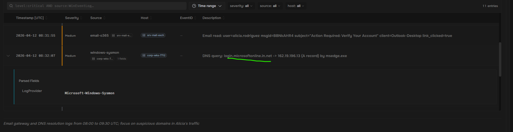
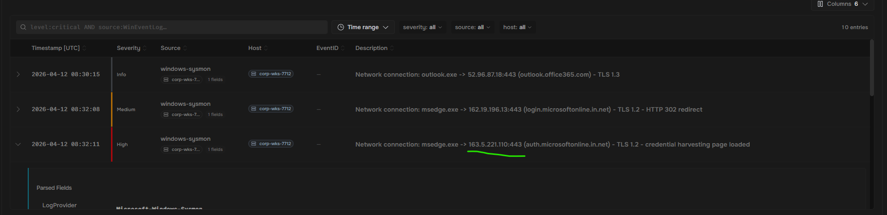
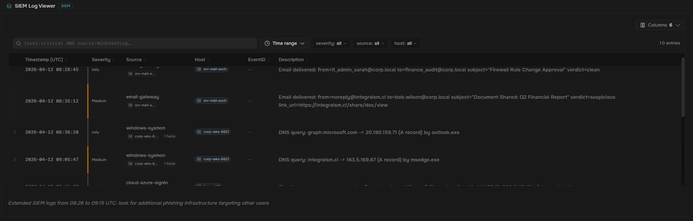
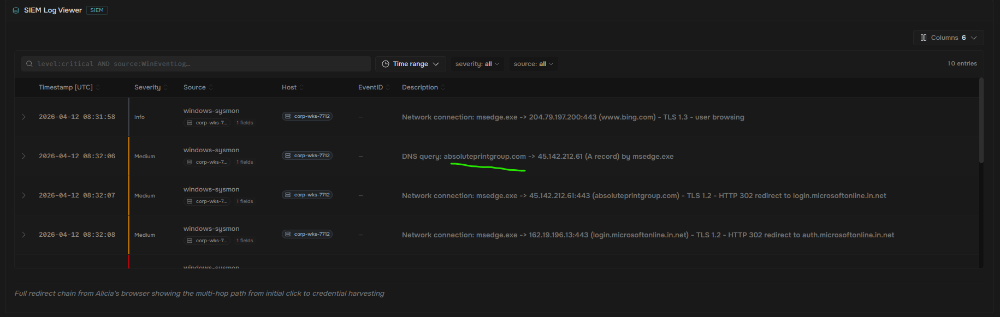
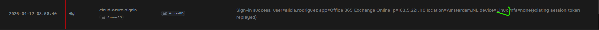

#This lab was hosted by SOC Simulator

#In this lab, I investigated an adversary-in-the-middle (AiTM) credential phishing campaign that lured an employee to a lookalike Microsoft 365 login page. Working entirely from SIEM logs, I identified the lookalike domain, reconstructed the multi-hop redirect chain through a compromised legitimate site, uncovered a secondary phishing wave against another employee, and confirmed the account takeover in Azure AD sign-in logs via impossible travel and session-token replay. I finished by choosing the containment action that actually evicted an attacker holding a valid session token.

#Demonstrated skills - Lookalike-domain analysis, identity-centric incident response, SIEM log analysis

#Summary - In this SOC lab simulation, I received an alert from the simulated company's email displaying the following: Employee Alicia Rodriguez on workstation corp-wks-7712 clicked a link in a suspicious email that redirected her to what appeared to be a Microsoft 365 login page. Her credentials have likely been compromised.

#NOTES: Adversary-in-the-Middle (AiTM) phishing is a technique where attackers stand a proxy server between the victim and the real authentication service. The victim sees a convincing login page, often on a lookalike domain, and enters their credentials there. The proxy passes them through to the genuine service and keeps a copy of everything it sees, including the session material the service hands back once multi-factor authentication has been satisfied.
  #Why are lookalike domains so effective? A domain name is read from the right, but the eye reads from the left, and attackers build for the eye. They borrow a trusted brand word, put it where the glance lands, and attach it to a name they registered themselves. Character substitutions, extra subdomains and unfamiliar endings all pass as close enough at speed. The habit that defeats all of them is mechanical: read the ending first, because that is the part that says who actually operates the name.

#What is known so far:
  #Affected user: alicia.rodriguez (workstation corp-wks-7712)
  #Two phishing emails were delivered to her mailbox from external senders
  #At least one email contained a link to a lookalike login page
  #Multiple suspicious domains and IPs have been flagged by our intel feeds
  #Azure AD sign-in logs show anomalous activity for Alicia's account

#Two messages arrived in Alicia's mailbox the morning of the attack, sitting among the ordinary traffic of a working day. One of them carried the link that ended with her credentials on somebody else's server.

#The website link showed above was the falsified email. The attacker sent this link knowing that it looks legitimate, but used it to steal the credential information of their victim.

#The problem is that finding a phishing link doesn't hurt the attacker much. Phishing kits oftentimes have thousands of false names to disguise their attacks. Even more important is to find the machine launching the attacks.

#Reviewing the high priority log revealed that the HTTPS server belonged to 163.5.221.110 (utilizing port 443). Identifying the machine in this instance has much more impact against the attacker, since changing IP addresses costs much more than simply rotating phishing links.

#Even with one domain name verified, it's rarely all that the attacker has at their fingertips during an attack. An operator who registers one domain for one lure usually registered others, and often sends a second wave while the first is still being investigated. I looked through other workstations across the whole environment to find a similar attack:

#Here, I found a second attack targeting Bob Wilson. The attack used integraism.cl to share a fake financial report. Bob clicked on it and fell victim to the second wave of attacks.

#NOTE: Phishing kits seldom put the destination in the message. A link that points somewhere unremarkable survives a scanner that only checks the first URL it finds, and the real journey happens afterwards in the browser, one redirect at a time.

#The sequence shown in the SIEM logs is every hop Alice's browser made, in order, from ordinary browsing through to the credential form.

#NOTE: Redirect gates are usually somebody else's property. An attacker who compromises a small, legitimate site gains something a freshly registered domain cannot buy: age, a clean reputation, and a name no blocklist has ever heard of. Burning it costs them nothing, which is why the first hop of a phishing chain is so often an ordinary business with no idea it is involved.

#The first hop is the piece my email controls actually inspected, and the piece that decided whether the next thousand copies of the lure got delivered. It is also a second victim: an organization whose site was being used to launder traffic and which almost certainly did not know. Telling them is part of the job, and it starts with naming the host.

#The corrupted host, shown above, is absoluteprintgroup.com

#Now, I had traced the lure, the gate, and the proxy. Unfortunately, none of this proved that anybody used what was stolen. Identity telemetry is where that question is settled: every authentication carries where it came from, what asked for it, and how the identity was proven.

#NOTE: A stolen session cookie authenticates without any of the noise a stolen password makes. There is no failed attempt, no reset prompt and no second-factor challenge, because the identity provider was already satisfied at the moment the cookie was issued. That is what separates an adversary-in-the-middle case from ordinary credential theft, and it is why these cases are proved in identity logs rather than on the endpoint. Submit the value on its own, exactly as the record writes it.
  #Why this matters: MFA did not fail here, and writing the ticket up as an MFA failure focuses on the wrong control. If I told the SOC Engineer to adjust the rule based solely on this factor, the attacker would be able to get in again.

#The attacker signed in as Alicia from their own machine. The problem is that the same machine that they logged into gave them away. The OS used was Linux, not the corporate Windows.

#Impact summary: one confirmed account compromise with the attacker still active, one further employee targeted who did not follow the link, and no endpoint malware anywhere in the telemetry. The recap above is everything the investigation established. Nothing beyond it is known.

#Containment decision: In order to prevent the attacker from getting in again, I enacted the following response action first: Revoke alicia.rodriguez's active sessions and tokens, then reset her password
  #The reason for doing this is that the attacker was still inside our system at the time. Simply changing her password or kicking others out wouldn't have done much to actually get rid of them. By revoking the session first, I was able to remove the attacker from the system entirely. Then, I isolated the system so that it couldn't get back onto servers or access any devices. Password resets and account recovery happened afterwards in a safe environment.
#https://www.socsimulator.com/achievements/room/credential-harvesting-lookalike-login?ref=share&via=sheepdogcyber&utm_source=copy&utm_medium=social
