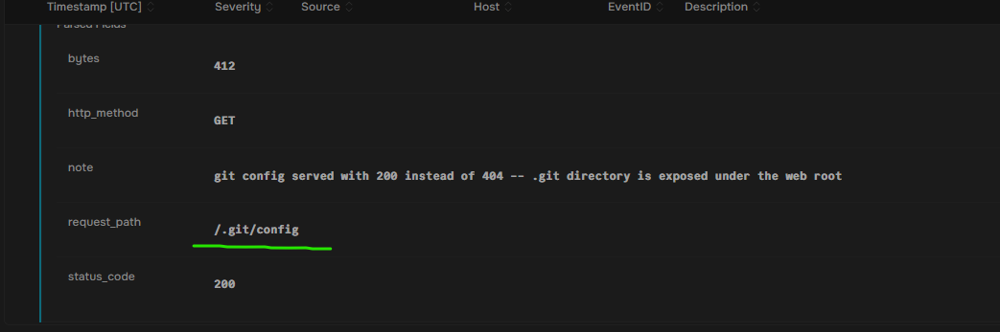
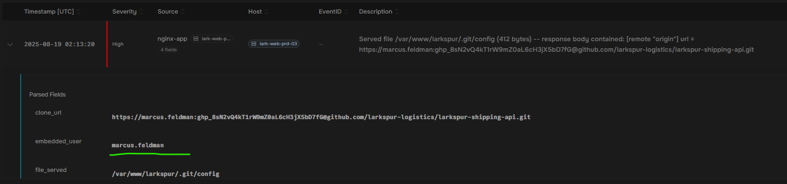
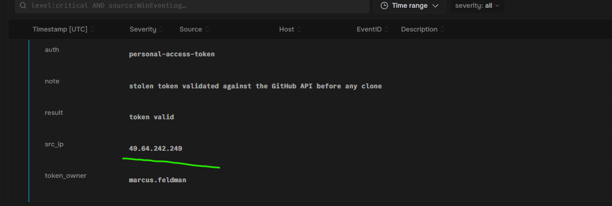
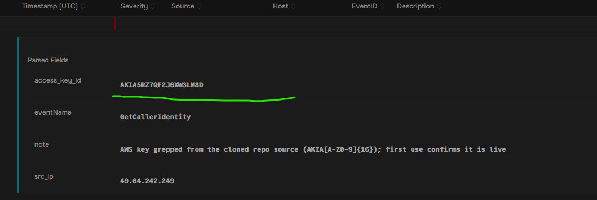

#This lab is hosted by SOC Simulator

#Summary: A public web server at Larkspur Logistics was deployed straight from a git checkout, leaving its .git directory exposed to the Internet. Following the EMERALDWHALE playbook, an attacker pulled /.git/config, stole the GitHub token baked into the clone URL, cloned the private repository, and found a hard-coded AWS key inside that handed them the account. In this lab, I walked the access, GitHub, and CloudTrail logs step by step to trace on misconfiguration into a full credential-theft chain.

#What happened: Larkspur Logistics runs its marketing and customer app on lark-web-prd-03, a public Nginx server. The site was deployed by cloning a git repository straight into the web root, which left the repository's own hidden metadata directory reachable over the Internet. One file inside that directory was handed to anyone who asked for it by name. That single file still had a developer's GitHub access token baked into it. From there, an attacker had everything they needed to clone the private source, find an AWS key hard-coded inside it, and walk into the company's cloud account.

#The Chain in four moves:
  #Recon: An automated scanner swept the server for hidden dotfiles, and one of the paths it tried came back with content instead of a not-found.
  #Token theft: The exposed file leaked a clone URL containing a GitHub personal access token.
  #Repo clone: The attacker validated the token against GitHub, then cloned the private repository.
  #Cloud pivot: A hard-coded AWS key inside the source was used to enumerate the account and create a rogue admin user
  NOTE: This is the EMERALDWHALE pattern: no software exploit, no malware -- just one misconfigured web server and secrets that were committed where they never should have been. Every step is a plain HTTPS request, which is exactly why it slipped past perimeter controls.

#Early in the morning, one external address swept lark-web-prd-03 for hidden configuration files. The access log below showed it requesting several dotfile paths in quick succession. All but one of them failed. The single request that did not fail was the misconfiguration that started everything.

#NOTE: Every nginx access line records three things about the request: the path that was asked for, the HTTP status the server chose to return, and the number of bytes it sent back. Paths beginning with a dot are hidden files that a correctly configured server never puts on the public web.

#The attackers used the following filepath to get to the directory: /.git/config at 2:13 am

#When this file was served, its body included the repository's remote origin URL. Git clone URLs can carry credentials inline in the form https://<user>:<token>@github.com./<org>/<repo>.git. The application log captured the served file's contents. Here, I reviewed it and identified the username whose personal access token was embedded in that clone URL.

#In this attack, it was Marcus Feldman's account that was compromised

#Roughly 20 minutes after the file was exposed, a second external address authenticated to the GitHub API using the stolen token, confirmed it was valid, and then cloned the private repository. Here, I searched the GitHub audit entries that our SIEM recorded and found the attacker's IP address.

#The attacker's IP was 49.64.242.249.

#Once the private repository was cloned, the attacker searched its source for A#WS access keys -- strings matching AKIA[A-Z0-9){16}. They found one hard-coded in the project's configuration and immediately tested it against the AWS API. The CloudTrail entries below show that key calling GetCallerIdentitiy and then enumerating IAM users. I reviewed them and identified the AWS access key ID that was used.

#The key that was used was AKIA5RZ7QF2J6XW3LM8D

#At this point, Priya from the DevOps team was racing to lock the account down. Around 03:21, the stolen key created a brand-new IAM user and attached the AdministratorAccess policy to it -- a foothold for sending spam and phishing through the company's cloud account. I reviewed the CloudTrail entries from our SIEM tool and found the creation and the policy attach. After reviewing them, I found the exact name and identity of the IAM user that was created.

#The new user account was mailer-sns-smtp

#This mattered because revoking the stolen key at this point would feel like remediation and would change nothing, because the attacker already minted a credential of their own with full admin rights. Enumerating what an intruder created, not only what they used, is the difference between eviction and a return visit. It is also why account creation and privilege attachment belong on the alert list even when they succeed, since a successful one produces no error for anything else to catch.

#In order to help the DevOps team come up with a better security method, I also mapped the attack pattern. In this instance, MITRE ATT&CK T1552.001 — Unsecured Credentials: Credentials In Files, lined up with the attack pathology. They never used bugs to exploit the system, just a compromised file.
