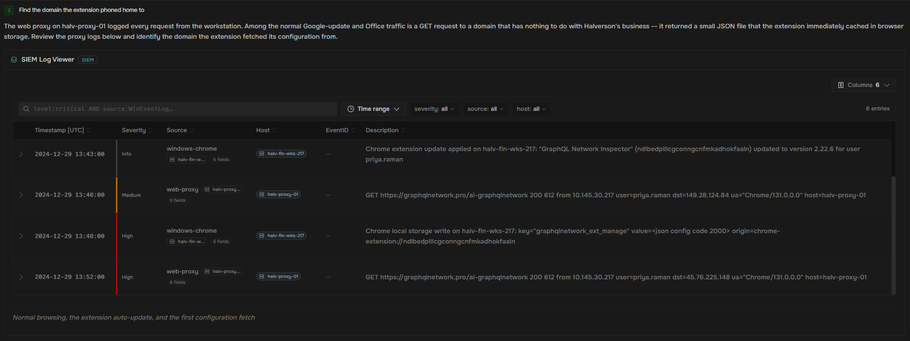
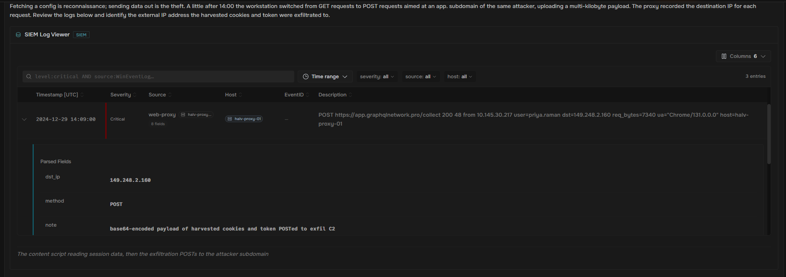
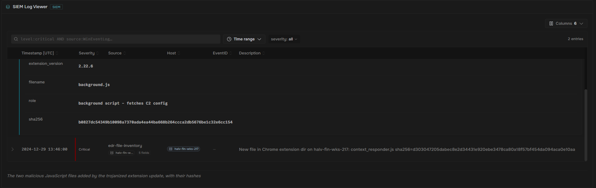
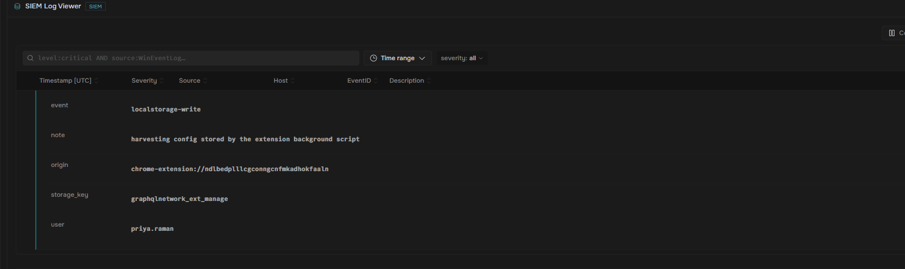

#This lab is hosted by socsimulator.com

#A routine Chrome auto-update silently trojanized a productivity extension on a finance workstation at Halverson Logistics. The extension beaconed to an attacker C2 domain, harvested the analyst's session cookies and an API token, and exfiltrated them to a VULTR-hosted
#server. With no malware on the disk, the proxy and firewalls were the only trail available. In this lab, I will demonstrate step by step how to trace the beacon, the theft, and the exfiltration of the analyst's data.

#The attack happened in three stages:
  #Stage 1 (beacon) - The extension's background script fetched a JSON configuration file from the attacker's C2 domain over HTTPS
  #Stage 2 (harvest) - An injected content script read that config from browser storage, then scraped session cookies and an API token from the analyst's active browsing
  #Stage 3 (exfiltrate) - The stolen cookies and token were POSTed to an attacker-controlled app subdomain
#Note: Because everything happened on HTTPS on port 443, the firewall saw only allowed outbound web traffic

#The web proxy on halv-proxy-01 logged every request from the workstation. Among the normal Google-update and Office traffic is a GET request to a domain that has nothing to do with Halverson's business - it returned a small JSON file that the extension immediately 
#cached in browser storage

#Reviewing the GET requests showed that the graphqinetwork.pro request was used to host the JSON file

#I needed to find out where the stolen cookies were sent. Fetching a config is recon, but sending data out is the theft. A little after 14:00, the workstation switched from GET requests to POST requests aimed at an app. subdomain of the same attacker, uploading
#a multiple-kilobyte payload. The proxy recorded the destination IP for each request.

#Reviewing the logs showed that both POST requests came from the same destination IP - 149.248.2.160. This was our attacker

#I needed a concrete indicator to hand to the rest of the fleet so that other infected machines could be found. The trojanized 2.22.6 build of the extension added two new JavaScript files inside the Chrome extension directory. One of them, background.js, is the background
#script that fetches the C2 config.

#When i noticed that one of the logs contained the "background.js," I knew that it was the one I was looking for. The matching SHA 256 was the background script that fetched the C2 config, not the content script that read cookies
  #SHA256 b0827dc54349b10098a7370ada4ea44ba668b264ccca2db5676be1c32e6cc154

#Once the background script pulled the JSON config from the C2, it wrote it into Chrome's local storage so the injected content script could pick it up. The endpoint telemetry captured that write, including the exact key name.

#In this case, the storage key was graphqlnetwork_ext_manage. By finding this key on another machine, we could confirm that it had been infected by the same trojan

#The injected content script read the cookie store for the active tab and shipped the session cookies out to the C2. Stealing a valid session cookie let the attacker resume an authenticated session without ever needing the password or a second factor (MFA).
#This behavior maps to T1539, a MITRE ATT&CK known as Credential Access. By identifying the technique used, as well as the IP address, I was able to begin the remediation process.
