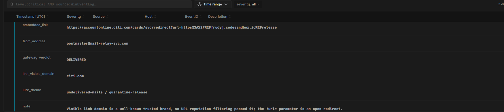
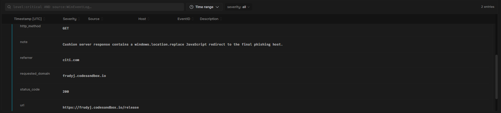
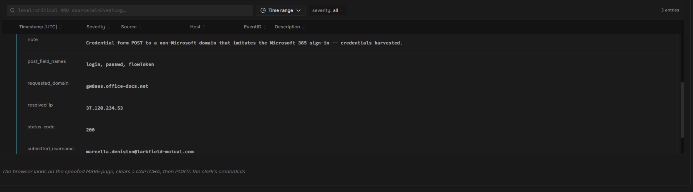
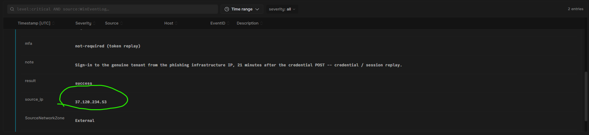

#This lab is from socsimulator.com

#Briefing:

  #A finance clerk at Larkfield Mutual Assurance clicked a Release my Messages link in an Undelivered Mails phishing email. The link opened with a trusted brand domain that carried an open-redirect flaw, allowing it to sail
  #past URL filtering. In this lab, I followed the 302 redirect through an attacker cushion server and a JavaScript hop to a spoofed Microsoft 365 login page. I then caught the harvested credentials being replayed against
  #the real tenant

#The redirect chain in three hops
  #Hop 1 (open redirect) - The trusted-brand link returns an HTTP 302 whose Location header sends the browser off to an attacker-controlled cushion server
  #Hop 2 (cushion server) - That intermediate page runs a windows.location.replace JavaScript redirect, hiding the final destination from any tool that only inspects the visible link
  #Hop 3 (credential harvest) - The browser lands on a spoofed Microsoft 365 sign-in page, gated by a CAPTCHA to dodge automated analysis, where the credentials are stolen

#The mail gateway on lkf-mail-01 logged the inbound message to the clerk, including the full URL embedded behind the Release My Messages button. The visible domain at the front of that URL is a recognizable brand, which is
#exactly why the gateway's URL reputation check passed it

#The logs indicated that the phishing message had a display name from CitiBank, a trusted financial institution. When the victim clicked on the link, he fell for a common phishing scheme

#The web proxy lkf-proxy-01 recorded the click. The request to the trusted-brand URL did not return a normal page; it returned an HTTP 302 redirect, and the Location it pointed at is the attacker's intermediate cushion
#server. The very next request shows the browser fetching that cushion page

#The status_code 302 entry carried a redirect_location field. The host inside that Location, which the next request then loaded with a 200, is the cushion server. It was hosted on a developer sandbox service, not a Microsoft
#Domain.

#darnell.okafor from the service desk needed the exact phishing domain to block at the proxy and to scopt the credential reset. After the cushion server loaded, a windows.location.replace JavaScript redirect carried the
#browser to the final page, which rendered a fake Microsoft 365 sign-in form behind a CAPTCHA. The proxy log captured that landing request and the credential POST that followed

#The referrer of the landing request was the cushion server seen from earlier, which confirmed the JavaScript hop. The requested_domain of that landing page, gw8aes.office-docs.net, was the same host that receives the
#credential POST. It was also the answer I needed to find

#I compared the two Microsoft 365 sign-ins for the clerk. Earlier in the day, there was a normal, MFA-satisfied sign-in from a corporate egress address. Later, after the credential POST, there was a second sign-in to the
#genuine tenant from an external address that had no business serving Larkfield staff. Thtat second address was the phishing infrastructure replaying the stolen credentials

#The later sign-in using the following IP address was the answer. I was able to track the external Ip address from the second login:
  #37.120.234.53
  

#The reason that this phish slipped past reputation filtering is impersonation. By mimicking a Microsoft Exchange postmaster notification, the email and the link appeared to be a safe destination by opening with a trusted
#brand's domain. The attacker assumed a trusted identity, both the sender persona and the brand in the URL, to manipulate the victim and the filter

#Since the attacker utilized a trust flaw with the human user, not the computer, we can assume that it falls under a social engineering tactic. T1684.001, Impersonation, fits the attack methodology perfectly. The attacker
#pretended to be someone that they weren't, and convinced the victim that they were who they were pretending to be. The computer was unable to detect a flaw, since the identity was masked behind a CAPTCHA, which limited
#its access.

#Resolution - With the attack methodology recognized, the phishing link, website, and IP address were all blacklisted
